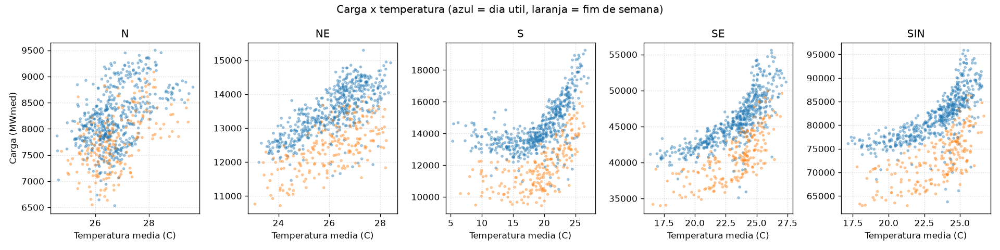
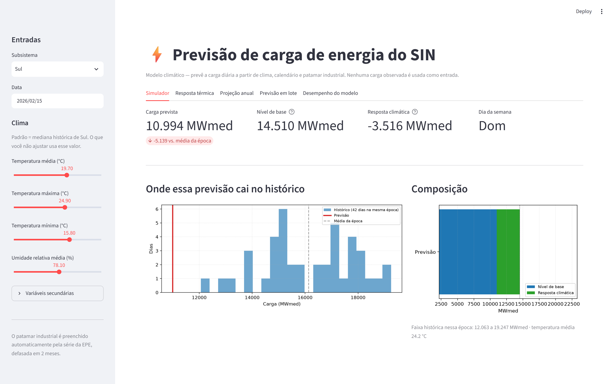
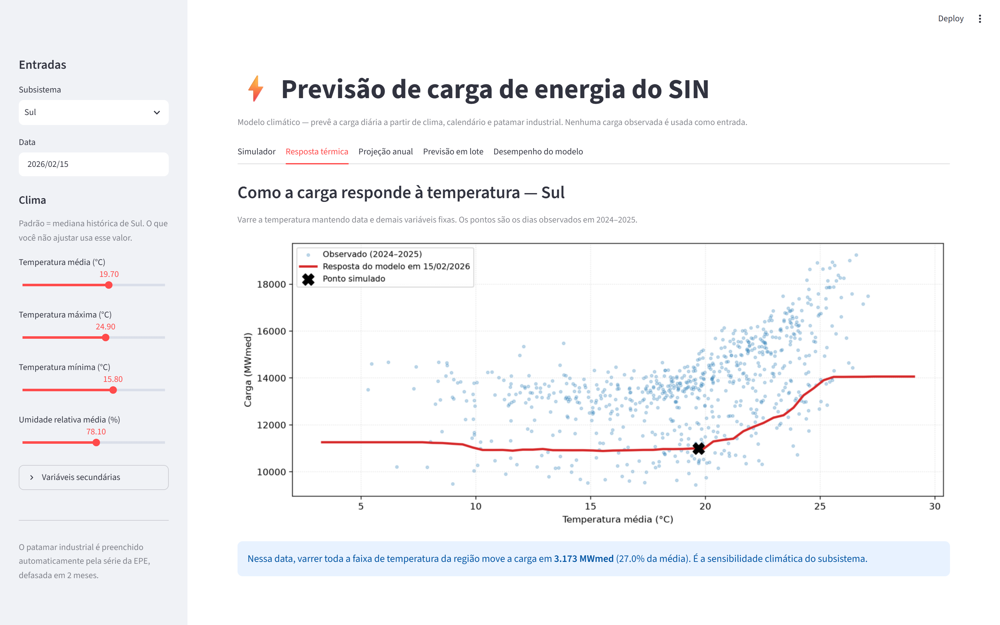
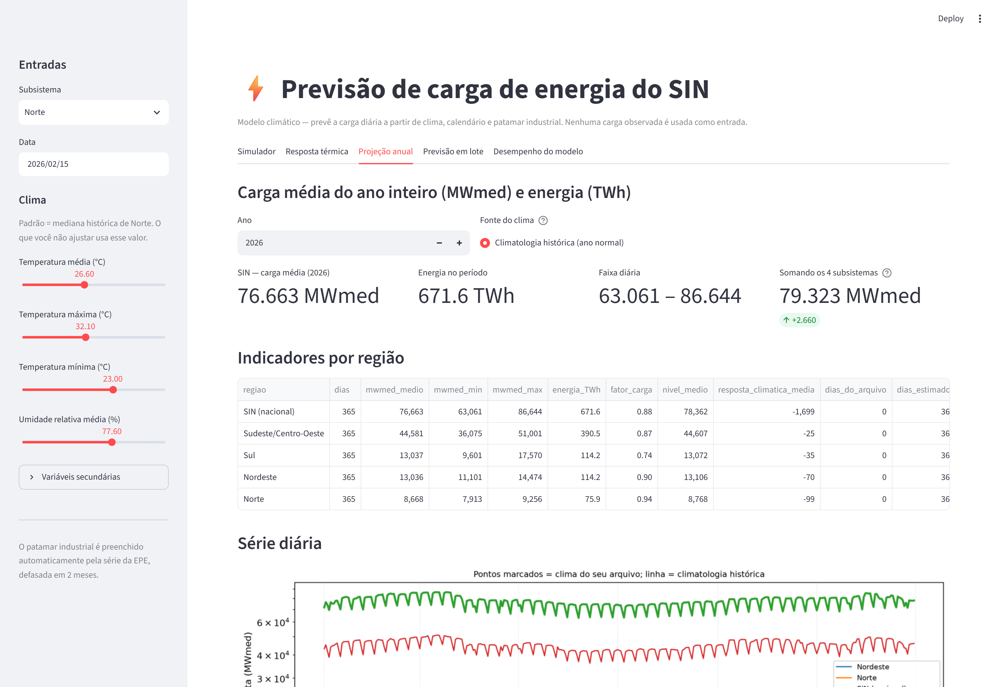

# Previsão de carga de energia do SIN a partir do clima

[](https://github.com/Omateuso/ML_ENERGIA/actions/workflows/testes.yml)


Prevê a carga diária de energia (MWmed) dos quatro subsistemas do Sistema
Interligado Nacional — Norte, Nordeste, Sul e Sudeste/Centro-Oeste — mais o
agregado nacional, usando clima, calendário e patamar industrial.

O projeto é organizado em torno de uma pergunta: **a previsão está mesmo
apoiada no clima, ou está reciclando a carga observada que também serve de
gabarito?** Toda a estrutura de features, modos de previsão e avaliação existe
para tornar essa pergunta respondível.



*A relação que o modelo aprende. O Sul tem curva em U (aquecimento à esquerda,
refrigeração à direita), o Sudeste sobe acima de 22 °C, e o Norte é quase
plano — por ser dominado por carga eletrointensiva, que não responde a
temperatura. Azul é dia útil, laranja é fim de semana.*

---

## Fontes de dados

Todas públicas e baixadas por `scripts/01_coletar.py`.

| Fonte | Conteúdo | Granularidade |
|---|---|---|
| **ONS** — Carga de Energia | Carga por subsistema (alvo) | Diária |
| **INMET** — Dados históricos | Temperatura, umidade, radiação, vento, chuva | Horária, por estação |
| **EPE** — Consumo por classe | Consumo industrial por subsistema | Mensal |

---

## Os três modos de previsão

A distinção entre eles é o ponto central do projeto. Modos diferentes recebem
informações diferentes, e por isso **não são comparáveis entre si**.

### `climatico` — previsão a partir do clima
Nenhuma feature autoregressiva. A carga do ano de teste nunca entra como
insumo, então contaminação é impossível por construção. É o modo que responde
"quanto esta região gasta com este clima".

Como o XGBoost não extrapola além do intervalo do alvo visto no treino, a carga
é decomposta:

```
carga = nível(industrial)  +  resposta_climática
        └─ regressão linear   └─ XGBoost sobre o resíduo
           (extrapola)           (estacionário)
```

### `delta_d1` — previsão operacional de um dia à frente
Prevê a variação diária usando a carga observada de ontem. Legítimo para D+1
(ao prever amanhã você conhece hoje), mas **não é "prever o ano"**.

### `delta_recursivo` — horizonte longo
O mesmo modelo delta realimentando as próprias previsões. Não lê carga
observada após a semente inicial.

---

## Como as garantias são impostas

**Separação de features por grupo.** `CALENDARIO`, `CLIMA`, `INDUSTRIAL` e
`AUTOREGRESSIVO` em [features.py](src/energia/features.py). Só o último toca a
carga observada, e o modo climático o exclui por completo. Há teste para isso.

**Defasagem da série industrial.** Consumo industrial é um *componente* da carga
total. Usar o valor do próprio mês entregaria parte da resposta, então a série
é defasada em 2 meses — o atraso real de publicação da EPE. Configurável via
`--defasagem-industrial`.

**Médias móveis com `shift(1)`.** `media_7d` cobre t-7..t-1, nunca o dia atual.

**Baselines por classe de informação.** Um modelo que não lê a carga do ano de
teste não é cobrado contra um baseline que lê:

- *sem carga observada*: média do treino, climatologia
- *com carga observada*: persistência, semana anterior

**Teste de contaminação.** Embaralha grupos inteiros de features e mede o
estrago. Se embaralhar o clima quase não muda o erro, a previsão não está
apoiada em clima.

---

## Resultados (treino em 2024, teste em 2025)

MAE em MWmed. Ganho medido contra o melhor baseline da mesma classe.

| Região | `climatico` | ganho | `delta_d1` | ganho | `delta_recursivo` | ganho |
|---|---|---|---|---|---|---|
| Norte | 251,9 | +55,6% | 150,6 | +27,5% | 528,1 | +6,9% |
| Nordeste | 431,0 | +39,8% | 225,1 | +47,2% | 466,7 | +34,8% |
| Sul | 711,8 | +52,1% | 389,0 | +55,7% | 597,8 | +59,8% |
| Sudeste/C-Oeste | 1.724,0 | +49,1% | 817,8 | +61,4% | 1.828,5 | +46,0% |
| **SIN (nacional)** | 3.112,0 | +41,2% | 1.285,6 | +53,1% | 3.405,4 | +35,7% |

### Somar os subsistemas bate o modelo dedicado do SIN

O SIN tem modelo próprio, mas vale comparar com simplesmente somar as quatro
previsões regionais:

| Estratégia para o SIN | MAE | Acurácia |
|---|---|---|
| Modelo dedicado (`climatico`) | 3.112,0 | 96,22% |
| **Soma dos 4 subsistemas** | **2.486,1** | **96,98%** |
| Modelo dedicado (`delta_recursivo`) | 3.405,4 | 95,72% |
| **Soma dos 4 (`delta_recursivo`)** | **2.849,5** | 96,45% |

Somar é **20% mais preciso**. Os erros regionais são parcialmente independentes
e se cancelam no agregado. Os dois caminhos ficam disponíveis; a interface usa
o modelo dedicado e sinaliza essa diferença.

### Teste de contaminação — piora do MAE ao embaralhar cada grupo

Modo `climatico`:

| Região | clima | industrial | calendário | autoregressivo |
|---|---|---|---|---|
| Norte | +49,6% | **+46,8%** | +38,0% | +0,0% |
| Nordeste | +61,0% | +0,3% | +68,0% | +0,0% |
| Sul | +70,8% | +17,9% | +118,9% | +0,0% |
| Sudeste/C-Oeste | +89,2% | +0,6% | +78,1% | +0,0% |

O `+0,0%` em autoregressivo é a prova mecânica de que o modo climático não usa
carga observada. A piora alta no clima mostra que a previsão depende dele de
verdade.

O **Norte** é o único caso em que a feature industrial pesa tanto quanto o
clima (+46,8%). Faz sentido: o consumo industrial responde por ~40% da carga da
região, contra ~21% no Nordeste. Sem essa variável o Norte não fechava — o
modelo anterior chegava a R² **negativo** em horizonte longo.

---

## Interface gráfica

```bash
streamlit run app/app.py
```

Abre em `http://localhost:8501`. Cinco abas:

**Simulador** — escolha subsistema, data e clima nos controles laterais. Retorna
a carga prevista decomposta em *nível de base* (patamar industrial) e *resposta
climática* (quanto o clima e o calendário somam ou tiram), com um histograma
mostrando onde a previsão cai frente aos dias históricos da mesma época.



**Resposta térmica** — varre a temperatura mantendo o resto fixo e desenha a
curva de sensibilidade da região, sobreposta aos dias observados. É o gráfico
que mostra a curva em U do Sul e a subida do Sudeste acima de 22 °C.



**Projeção anual** — escolhe um ano e devolve a **carga média do ano em MWmed**
e a **energia em TWh**, por subsistema e para o SIN, com o perfil mensal. O
clima vem da climatologia (ano normal) ou do clima observado, quando existe.



Backtest de 2025, projetando com o clima real e comparando com o observado:

| Região | Projetado (MWmed) | Observado | Erro |
|---|---|---|---|
| Norte | 8.441 | 8.312 | +1,6% |
| Nordeste | 12.945 | 13.267 | −2,4% |
| Sul | 13.184 | 13.804 | −4,5% |
| Sudeste/C-Oeste | 43.726 | 44.226 | −1,1% |
| SIN (modelo dedicado) | 75.980 | 79.609 | −4,6% |
| **SIN (soma dos 4)** | **78.296** | 79.609 | **−1,6%** |

**Como ler esse número.** A média anual é dominada pelo *patamar* de carga, não
pelo clima: projetar 2025 com o clima observado deu praticamente o mesmo que
projetar com a climatologia (−4,6% contra −3,8% no SIN), porque as anomalias de
temperatura se compensam ao longo de 365 dias. O clima é o que explica a
variação **diária** — embaralhá-lo piora o erro diário em 55–89%. Para o total
do ano, quem manda é o nível industrial e o crescimento da carga.

O viés é sistematicamente negativo porque o modelo foi treinado só em 2024 e
não viu o crescimento de 2025. Treinar com mais anos deve reduzi-lo.

**Previsão em lote** — envie um **CSV ou Excel** (`.xlsx`, `.xlsm`, `.xls`,
`.tsv`) e receba **exatamente os mesmos indicadores da projeção anual**: carga
média em MWmed, mínima, máxima, energia em TWh, fator de carga, decomposição
média entre nível de base e resposta climática, série diária, perfil mensal e
confronto com o observado quando o período já aconteceu. As duas abas usam o
mesmo bloco de resultado, então não divergem. Há arquivos de exemplo nos dois
formatos na própria aba.

Exemplo real — planilha com **um único dia** informado para as 5 regiões,
completada até 31/12/2025:

| Região | Dias | MWmed médio | Energia | Do arquivo | Estimados | Erro vs. observado |
|---|---|---|---|---|---|---|
| SIN | 356 | 76.598 | 654,5 TWh | 1 | 355 | −3,8% |
| Sudeste/C-O | 356 | 44.297 | 378,5 TWh | 1 | 355 | +0,1% |
| Sul | 356 | 13.058 | 111,6 TWh | 1 | 355 | −5,4% |
| Nordeste | 356 | 13.034 | 111,4 TWh | 1 | 355 | −1,6% |
| Norte | 356 | 8.512 | 72,7 TWh | 1 | 355 | +2,2% |

A leitura é tolerante ao que uma planilha real traz:

| Variação | Tratamento |
|---|---|
| `;` como separador, vírgula decimal, latin-1 | Detectados automaticamente |
| Coluna `Região`, `Temperatura Média`, `Data`… | Mapeadas por lista de sinônimos |
| Região por extenso (`Nordeste`) ou sigla (`NE`) | Ambas aceitas |
| `Centro-Oeste` | Lido como `SE`, o subsistema do ONS a que pertence |
| Data `05/03/2026` | Interpretada como dia primeiro |
| Excel com várias abas | Seletor de planilha na interface |

Obrigatórias só a região e a data; qualquer variável de clima ausente usa a
mediana histórica da região. O **SIN** é aceito como região (`SIN`, `Brasil`,
`Nacional`, `Total`). Arquivo corrompido, protegido por senha ou com extensão
que não bate com o conteúdo produz mensagem explicando o problema.

**Arquivo que não cobre o período todo.** Marque *"Completar o período com a
climatologia histórica"* e escolha até quando prever. Os dias informados por
você são preservados; os demais recebem o clima típico da região naquele dia do
ano — mediana histórica suavizada por janela circular de 15 dias, para o
31/dez ser vizinho do 1/jan. A coluna `origem` marca cada linha como `arquivo`
ou `climatologia`, e o gráfico destaca os dias que vieram do seu arquivo.

Assim um arquivo com cinco dias de janeiro vira uma projeção do ano inteiro,
com resumo de carga média, mínima, máxima e energia total em TWh.

**Desempenho do modelo** — acurácia por região, métricas completas, teste de
contaminação e as séries de 2025.

A interface usa **apenas o modo `climatico`**: nenhum campo pede carga
observada, então não há como contaminar uma previsão feita por ela.

Sensibilidade climática medida na interface, varrendo a faixa de temperatura de
cada região:

| Região | Variação de carga | |
|---|---|---|
| Norte | 8.082 → 8.401 MWmed | +3,9% |
| Nordeste | 11.271 → 12.484 MWmed | +10,8% |
| Sudeste/C-Oeste | 36.819 → 44.408 MWmed | +20,6% |
| Sul | 10.983 → 13.970 MWmed | +27,2% |

O Norte quase não responde — coerente com a carga industrial dominante.

---

## Estrutura

```
.
├── data/
│   ├── raw/{ons,inmet,epe}/     baixado, imutável
│   ├── interim/                 cache do clima agregado
│   └── processed/               dataset_modelo.parquet
├── src/energia/
│   ├── config.py                caminhos, constantes, mapeamento de regiões
│   ├── coleta.py                download das três fontes
│   ├── clima.py                 INMET horário → diário por subsistema
│   ├── industrial.py            EPE mensal → nível diário defasado
│   ├── features.py              montagem do dataset, grupos de features
│   ├── modelo.py                ModeloClimatico e ModeloDelta
│   ├── avaliacao.py             métricas, baselines, teste de contaminação
│   └── previsao.py              API de previsão usada pela interface
├── app/app.py                   interface Streamlit
├── docs/                        imagens do README
├── .github/workflows/           CI (pytest em 3.11, 3.12 e 3.13)
├── scripts/                     01_coletar → 06_projetar_ano
├── tests/                       96 testes
├── modelos/                     .joblib por modo e região
└── output/                      métricas, previsões, gráficos
```

---

## Como executar

Requer **Python 3.11 ou superior** (`pandas 3.x` e `numpy 2.x` não suportam
versões anteriores).

```bash
python -m venv .venv
.venv/Scripts/activate            # Linux/macOS: source .venv/bin/activate
pip install -r requirements.txt

python scripts/01_coletar.py           # ~195 MB, alguns minutos
python scripts/02_construir_dataset.py
python scripts/03_treinar.py
python scripts/04_avaliar.py
python scripts/05_visualizar.py
python scripts/06_projetar_ano.py --ano 2026
python scripts/06_projetar_ano.py --ano 2025 --com-clima-observado   # backtest

streamlit run app/app.py               # interface gráfica
pytest                                 # 96 testes
```

Outros anos: `python scripts/01_coletar.py --anos 2023 2024 2025`, depois
`03_treinar.py --ano-treino 2024` e `04_avaliar.py --ano-teste 2025`.

---

## Detalhes de processamento do INMET

- **Centro-Oeste → subsistema SE.** O INMET rotula pelas 5 macrorregiões do
  IBGE; o ONS opera 4 subsistemas, e o "Sudeste" do ONS é na verdade
  "Sudeste/Centro-Oeste". Sem esse mapeamento, 96 estações ficam órfãs e somem
  no merge.
- **Graus-dia por estação, não sobre a média regional.** Como `max(0, T − 22)`
  é não-linear, calculá-lo depois de promediar apagaria a contribuição das
  estações quentes — justamente o sinal que move o ar condicionado.
- **Deduplicação.** O INMET republica arquivos com o período no nome
  (`..._A_30-11-2025` e `..._A_31-12-2025`). Acumular downloads na mesma pasta
  duplica estações; a extração usa diretório limpo por ano.
- **Controle de qualidade.** Leituras fora de limites físicos viram NaN, e um
  dia só vale com pelo menos 18 horas de medição.

---

## Dados e o histórico do git

`data/` está no `.gitignore` — tudo é reprodutível via `01_coletar.py`.

O que fica em disco depois da coleta:

| Caminho | Tamanho | Precisa manter? |
|---|---|---|
| `data/raw/inmet/*.zip` | 186 MB | Sim — camada bruta; sem eles, reprocessar o clima exige novo download |
| `data/raw/{ons,epe}/` | 1,7 MB | Sim |
| `data/interim/clima_*.parquet` | 304 KB | Cache; regenerável a partir dos zips |
| `data/processed/` | 536 KB | Regenerável por `02_construir_dataset.py` |

Os CSVs extraídos do INMET (~750 MB) **não** são mantidos: `02_construir_dataset.py`
lê o cache em `data/interim/`. Para reprocessar do zero, rode `01_coletar.py`
(reextrai dos zips) e depois `02_construir_dataset.py --sem-cache`.

O diretório `dataset/` do projeto antigo (1,1 GB) foi removido da árvore, mas
**continua no histórico do git** — o pack ainda pesa ~258 MB. Tirá-lo do
histórico exigiria `git filter-repo`, que reescreve todos os commits e quebra
clones existentes; ficou deliberadamente de fora.

---

## Licença

MIT — veja [LICENSE](LICENSE).
